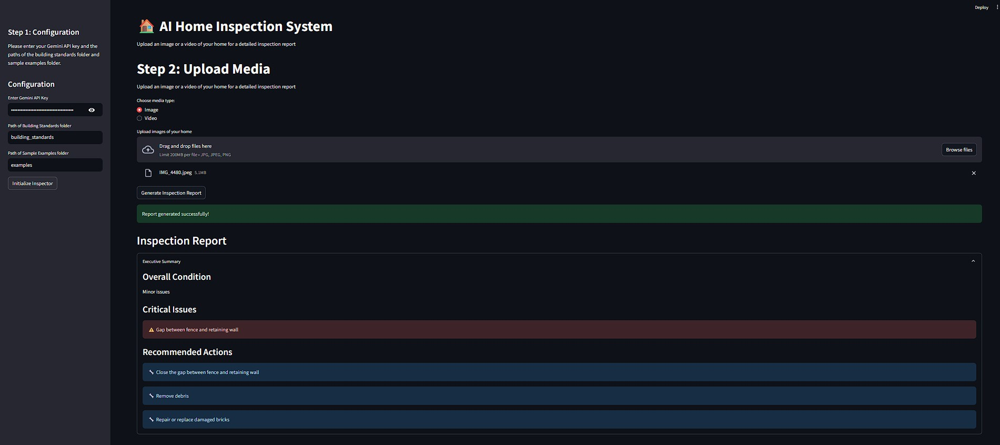

# 🏡 **Home Inspection AI App**

An **AI-powered web application** that simplifies and automates the process of generating home inspection reports. Built with **Streamlit** and powered by **Gemini AI**, the app collects inspection data, analyzes it, and produces a professional Word report along with a BI-style dashboard.

## ✨ **Features**

- 📋 **Dynamic input form** for entering home/property inspection details
- 🤖 **AI-generated inspection report** using Gemini AI (Word format)
- 📊 **Interactive dashboard** to visualize inspection data
- 📥 **Downloadable Word document**
- 🧠 **Powered by Google Gemini LLM**

## 🧰 **Tech Stack**

- **Frontend:** Streamlit
- **AI Model:** Google Gemini (Pro/Flash)
- **Backend:** Python (custom prompt engineering + data processing)
- **Reporting:** `python-docx`, `pandas`
- **Charts & Dashboards:** Streamlit Charts / Matplotlib
- **Deployment:** Streamlit Cloud

## Setup
<b>📦 Create a virtual environment (optional) </b>
python -m venv venv
source venv/bin/activate  # On Windows: venv\Scripts\activate

<b>📦 Install dependencies </b>
pip install -r requirements.txt

<b>▶️ Run the app </b>
streamlit run app.py

## output

## 🛠️ Future Improvements
- 🖼️ Image uploads for property inspection
- 🗺️ Map integration for property locations
- 🧾 Export dashboard to PDF
- 🔗 API integration with real estate tools

